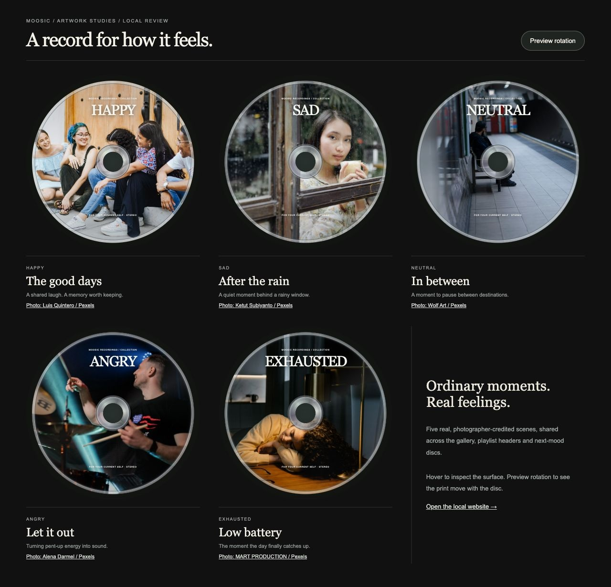

# MOOSIC real-photo CD artwork — 10 October 2026

All five generated cover images were replaced with real, photographer-credited photographs. The user approved these covers and the CD interactions for GitHub and production deployment on 10 October 2026.

## Photo sources and credits

| Mood / title | Photographer | Source photo |
|---|---|---|
| Happy / The good days | Luis Quintero | [Friends on steps](https://www.pexels.com/photo/smiling-friends-sitting-on-stairs-17674143/) |
| Sad / After the rain | Ketut Subiyanto | [A quiet moment by a cafe window](https://www.pexels.com/photo/pensive-woman-with-glass-of-coffee-standing-behind-big-window-4350190/) |
| Neutral / In between | Wolf Art | [Waiting at a metro station](https://www.pexels.com/photo/man-sitting-on-metro-station-16390532/) |
| Angry / Let it out | Alena Darmel | [A drummer performing live](https://www.pexels.com/photo/a-man-playing-drums-at-a-concert-7715785/) |
| Exhausted / Low battery | MART PRODUCTION | [Asleep at a desk](https://www.pexels.com/photo/a-woman-fall-asleep-on-a-desk-7606069/) |

Each source is offered under the [Pexels License](https://www.pexels.com/license/), checked on 10 October 2026. It permits website and CD-cover use and modification. Credits are retained here and in the local review even though attribution is optional. The pictured people do not endorse MOOSIC; mood labels describe the music collection, not a diagnosis or claim about the pictured person.

## Processing and integration

Downloaded the original photographs from the source pages' Pexels image host. Processing consists only of square cropping, resizing and WebP encoding; no generation, generative fill, retouching or AI upscaling. All native source dimensions exceed 2048 pixels in both axes. The exported cover images are 2048×2048 with 768×768 responsive versions.

Assets: `Frontend/MOOSIC-visual-refresh-final/MOOSIC-visual-refresh/attached_assets/cd-artwork/{happy,sad,neutral,angry,exhausted}.webp`, plus matching `-768.webp` variants. The generated files at these paths have been replaced, and the obsolete generation-prompt document removed.

The shared CD_ARTWORK mapping supplies the homepage, playlist header and destination disc. Eager image loading loads the next mood artwork when its playlist page mounts, before the transition reaches the viewport. Artwork stays inside the existing rotating disc layer. Navigation, animation timing, playback, authentication, Supabase and song data remain unchanged.

## Local review

[Preview all five discs](http://localhost:5173/artwork-review.html). Each cover links to its original photograph and photographer. The review page is not a production Vite build entry.

## Validation

`pnpm build` passed (TypeScript and production bundle); `git diff --check` passed. The local browser review showed all five photo assets loaded with no console errors. The final screenshot above contains the real photographs. No commit, push or deployment was performed.
